# 前言

SDK即（**Software Development Kit**）的缩写，意思是软件开发工具包。它能够帮助开发者在软件中快速构需要的功能模块，而仅仅只需要写入少量的代码。在软件开发过程中，你一定有过这样的场景：A项目中的功能某块功能曾经在B项目中也出现过，重写的话会造成公司资源的严重浪费。有一定规模的公司，生产过程中往往会累积很多技术经验和成果，这时候选择将一些通用的成果封装成SDK，可以满足公司在各种业务场景下的需要，快速组建app。


# iOS SDK

## iOS SDK分类

iOS SDK一般可以分为两大类：一类是**.framework**和**.a**另外一类iOS系统自带的**.dylib**(**.tbd**)。出于**安全**以及绕过**审核**等原因苹果不允许开发者使用**.dylib**、**.tbd**方式的库进行开发，所以不在文中讨论这类库文件，这里只讨论**.framework**和**.a**的开发和使用。


## .framework和.a

这里有一个误区，不少人认为：**.framework**是属于动态库**.a**属于静态库。**.a**是静态库这边没有太大疑问，其实**.framework**是静态库还是动态库主要和**Xcode-->Buld Setting-->Linking-->Mach-O Type**配置选项有关，即**Static Library**用于编译静态和**Dynamic Library**用于编译动态库。在使用静态库时，把库拖进工程，设置好**library search path**即可使用；在使用动态库时，多一个步骤，要在**Build Settings-->General-->Embeeded Binaries**中**add**一下，否则应用启动时会因为找不到文件而崩溃。另外选择**Static Library**方式打包出来的库文件通常要比选择**Dynamic Library**方式打包出来的库文件体积要大，**Static Library**方式打包出来的库会被一起编译Link进应用程序的可执行二进制文件中，**Dynamic Library**方式打包出来的库只是被完整地拷贝到应用的沙盒里。


## 如何制作iOS SDK

这边以**.framework**为例

1. 新建工程-选择Framework

   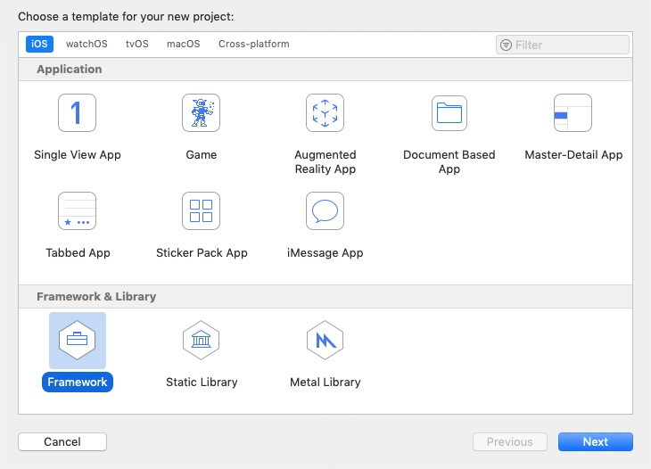

   

   

2. 为你的工程取一个漂亮的名字

   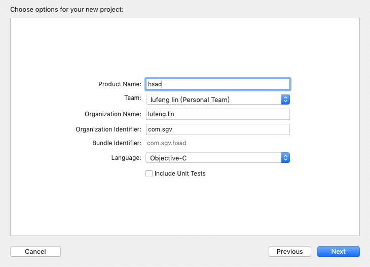

   

3. 选择Deployment info(即SDK运行环境)

   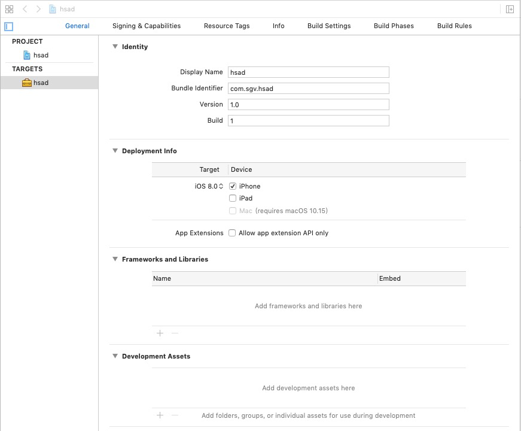

   

4. 选择Xcode-->Buld Setting-->Linking-->Mach-O Type，这边我选择Static Library

   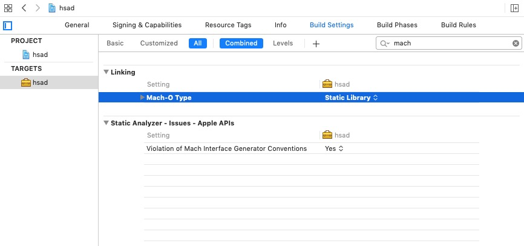

   

5. 导入或新建你的业务代码

   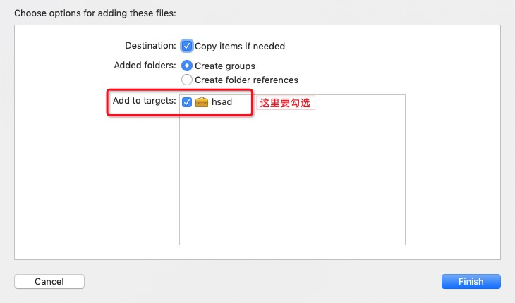

   

6. 设置要暴露的头文件

   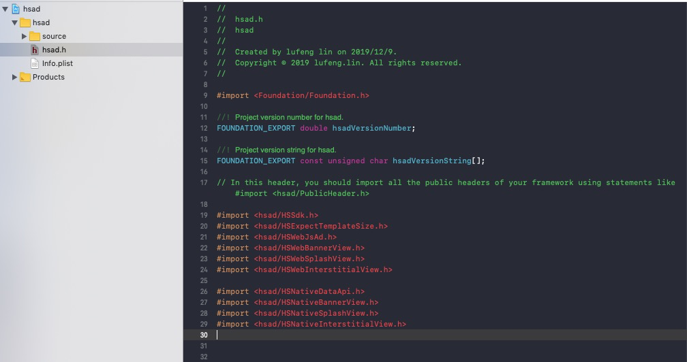

   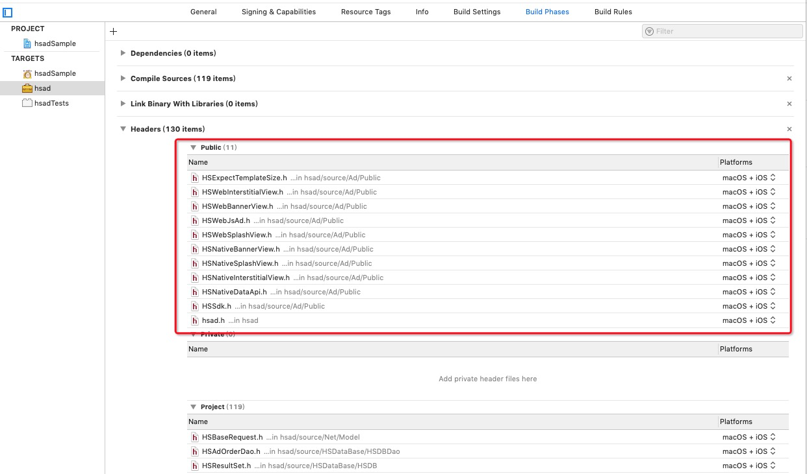

   

   

7. 设置工程依赖的库文件

   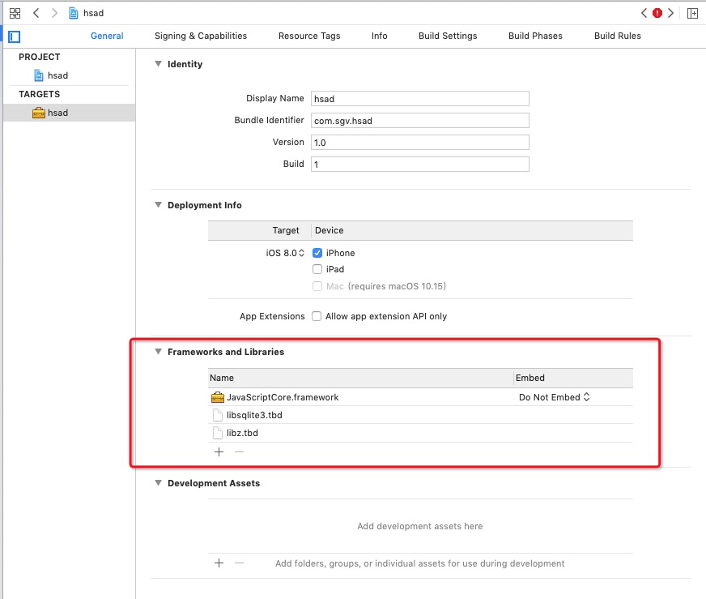

   

8. Build编译

   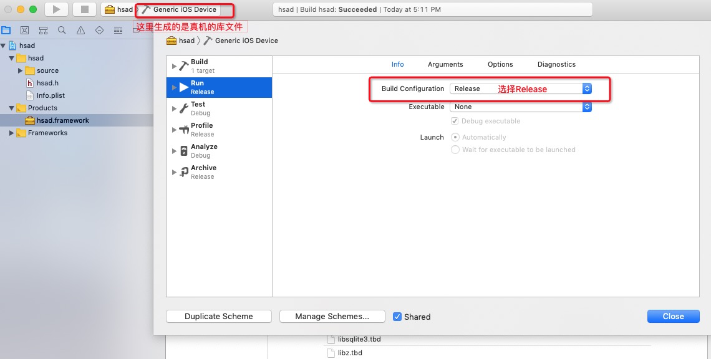

   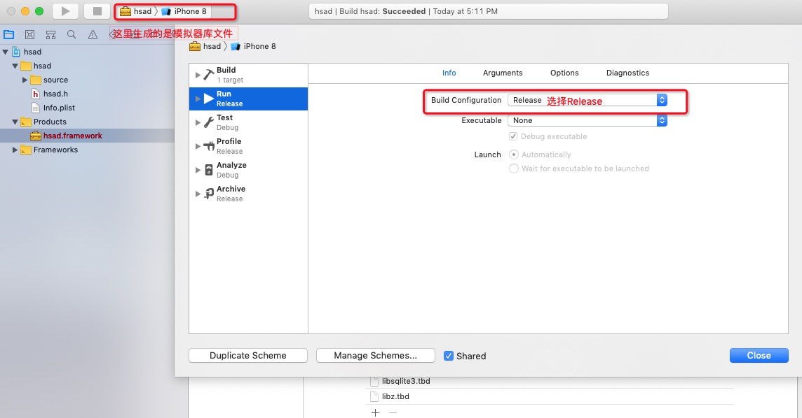

   

9. Lipo 命令合并真机&模拟器的库文件

   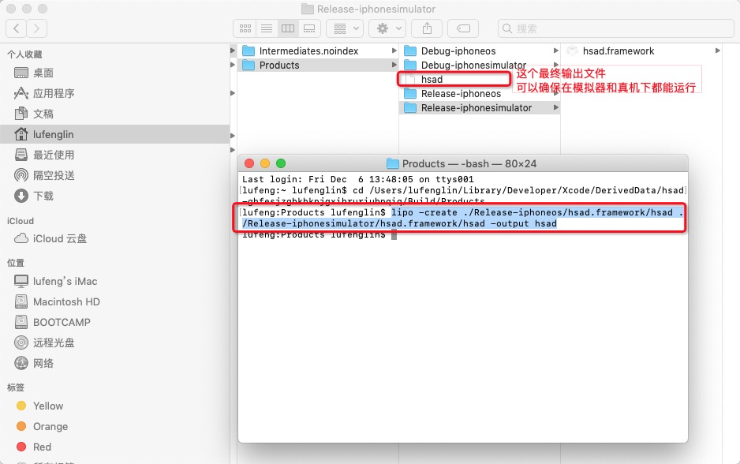

   

   选择工程目录Products-->had.framework-->Show in Finder找到最终生成文件目录，开打终端找到products目录合并模拟器&真机库文件。

   ```shell
   cd /Users/lufenglin/Library/Developer/Xcode/DerivedData/hsad-ghfesjzgbkhknjgxibruriubnqiq/Build/Products 
   
   lipo -create ./Release-iphoneos/hsad.framework/hsad ./Release-iphonesimulator/hsad.framework/hsad -output hsad
   ```

   

# 开发SDK期间遇到一些问题

## 接口设计

**精简**：SDK接口设计的一个最重要原则就是精简，时刻换位思考自己是一名SDK使用开发者，我拿到这份SDK该从哪里上手使用。尽量让开发者用最少的代码完成所想要的功能，想想这是一件多么令人自豪的事情。接口暴露，只为开发者提供最基本能用掉SDK业务的接口，其它SDK内部逻辑处理相关业务一律封装屏蔽起来不对外暴露。

**命名**：接口命名一定要规范，诸如iOS提供的UIKit头文件，通过方法名称就知道这个方法是做啥用处。

**注释**：头文件注释要写清楚，该方法的具体作用表现、各个参数是代表什么、返回什么样的结果，一份好的头文件注释，基本上可以当作SDK接入文档来使用。

**@property** **关键字**：善用@property关键字，例如一些接口在设计的时候，为防止开发者不小心修改，可以使用**readonly**关键字。

```objective-c
@property (nonatomic, copy, readonly) NSString *adNumber;          // 广告编号
```

**extern** 关键字：一些提供对外使用的字符串常量接口，可以使用extern关键字。

**NS_ENUM** 枚举：解决意义不明确，使代码更优雅。如定义广告执行类型：

```objective-c
typedef NS_ENUM(NSInteger, HSADActionType) {
    HSADActionTypeShow = 1,                   // 展示
    HSADActionTypeOpen = 2,                   // 打开链接
    HSADActionTypeAndroid = 3,                // 安卓下载无效
    HSADActionTypeDownload = 4,               // iOS应用下载
    HSADActionTypeLaunchApp = 5,              // 拉起app
    HSADActionTypeLaunchMiniProgram = 6,      // 唤起小程序
    HSADActionTypeLaunchLogic = 7             // 智能唤端
};
```

**参数校验**：SDK接入过程中往往会出现这样一种情况，接口文档会让传入指定的参数，但是我们的开发者并不一定会按所要求的参数来传，这时候就需要对传入的参数进行校验。**NSAssert**是一个很有用的宏，用于开发阶段调试程序中的Bug，通过为NSAssert()传递条件表达式来断定是否属于Bug，满足条件返回真值，程序继续运行，如果返回假值，则抛出异常，并且可以自定义异常描述。这样开发者就会得到反馈，并按要求重新传入正确的参数。

**弃用的接口**：由于SDK业务的变更对于一想老旧想要放弃使用的接口，可以使用**DEPRECATED**关键字来申明接口，而不是直接将接口从头文件中删除。这样编译器就会提示开发者相关接口可能被弃用，请使用最新的接口。

**版本号**：和开发App一样，版本号主要是用于记录SDK各个版本开发内容以及修复哪些Bug，亦可以标识线上各版本运行情况，分析日志埋点，帮助优化SDK。


## 是否使用第三方库

SDK开发过程中，你可能也会使用到网络、数据库、UI等各种各样的模块。此时你可以选择iOS自带的API来实现功能，也可以嵌套成熟的第三方库，当然我建议能自己开发的尽量自己开发，毕竟这样我们才能提高自己的开发能力。根据是否把第三方代码打包进我们自己开发的SDK，我将它分为两类**合并**和**引用**：

- **合并**

  如果一定要使用第三方的代码，最好是拿到开源代码，修改为和你的工程命名一致的命名，不然代码在编译的时候很容易和其它工程中文件相冲突。如果第三库不是源代码，而是以SDK形式提供的，那么在拖入工程的时候选择"**Add to Targets**"将第三方库一起合并进自己的SDK。

- **引用**

  引用顾名思义是不将第三方库合并到自己的SDK中的，在工程不勾选"Add to Targets"，仅在要使用第三方库的地方 **import** 头文件然后调用相关的方法，在发布自己SDK的时候，将第三方SDK以它原来的面貌，一起发布给开发者使用。 


## 埋点/日志

一个好的日志接口，可以有效的帮助自调试开发过程中出现的各式各样问题。这里我将自己开发过程中的日志分为三类：

-  **Debug**日志，只供自己开发SDK过程中查看。
-  **Error**日志，SDK运行过程中出现一些不满足预期结果的日志。

-  **User**日志，用来提供给开发者查看SDK运行情况。

也可以将日志输出到**.txt**文本文件中，在适当条件下，上传到服务器进行分析。

**埋点** 是对用户使用情况的一系列分析，一般最简单的是对相关事件event触发次数进行累加并上报，复杂一些的还可以记录用户使用页面的路径情况，页面停留时长等等。


## SDK资源包 .bunlde 文件

SDK开发中会使用到诸如图片等一些资源文件，我们可以将它们一起打包到**xxx.bundle**文件中去。

以图片为例，通过下面方式在代码中获取图片资源：

```objective-c
NSString *closePath = [[NSBundle mainBundle] pathForResource:@"hsad.bundle/close" ofType:@"png"];
UIImage *closeImage = [UIImage imageWithContentsOfFile:closePath];
```


## 文档

- **SDK接口设计文档**

  SDK设计文档，是在开发的之初定义的。它是SDK开发的一个概要设计，包含接功能模块的设计、对外接口的定义等。

- **SDK使用文档**

  SDK使用文档，是一份使用说明说，目的在于清晰并且快速的教会开发者，这套SDK能干嘛以及如何使用，并附有示例代码（**SDK SAMPLE**）。

  

## 测试/维护

SDK测试以及维护的依据，都源自SDK设计文档。


## 本文参考：

https://www.jianshu.com/p/71c75c287d26

https://www.jianshu.com/p/cf86532be5e4


