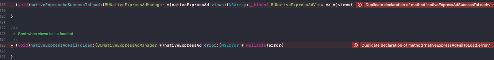

# 前言

最近公司准备开发的一款阅读App中需要同时加入“广点通”以及“穿山甲”平台的广告SDK，由于这款App还涉及到第三方一起开发，但是要求我方控制广告的使用，所以把不同平台的广告模块合并成一个SDK进行统一管理。在开发工程中就碰到了重载和重写等问题。


# 重载&重写的概念

**重载（overload）：**函数名相同，函数的参数列表不同(包括**参数个数**和**参数类型**)，至于**返回类型可同可不同**。重载既可以发生在同一个类的不同函数之间，也可发生在父类子类的继承关系之间，其中发生在父类子类之间时要注意与重写区分开。

**iOS Objective-C中重载，多见的是方法名相同，但参数个数/参数描述不同**。举例：

```objective-c
//
//  CunstomView.m
//

#import "CunstomView.h"

@implementation CunstomView

// 方法一
- (id)initWithFrame:(CGRect)frame{
    self = [super initWithFrame:frame]
    if (self) {
        
    }
    return self;
}

// 方法二重载方法一
- (id)initWithFrame:(CGRect)frame
              model:(NSDictionary *)model{
    self = [super initWithFrame:frame];
    if (self) {

    }
    return self;
}
@end
```

**重写（override）：**发生于父类和子类之间，指的是子类不想继承使用父类的方法，通过重写同一个函数的实现实现对父类中同一个函数的覆盖，因此又叫函数覆盖。注意重写的函数必须和父类一模一样，包括函数名、参数个数和类型以及返回值，只是重写了函数的实现，这也是和重载区分开的关键。

iOS Objective-C中重写举例：

```objective-c
//
//  CunstomView.h
//

#import <UIKit/UIKit.h>

NS_ASSUME_NONNULL_BEGIN

@interface CunstomView : UIView

@end

//
//  CunstomView.m
//

@implementation CunstomView
// 重写UIView的initWithFrame方法
- (id)initWithFrame:(CGRect)frame{
    self = [super initWithFrame:frame]
    if (self) {
        // 自定义界面
    }
    return self;
}

@end
```


# 遇到的问题

在合并的SDK功能的时候，发现**GDTNativeExpressAdDelegete**（广点通）原生类型广告代理和 **BUNativeExpressAdViewDelegate**（穿山甲）信息流类型广告代理，中竟然名字一模一模一样，怀疑这两家是互相借鉴的。

```objective-c
@protocol GDTNativeExpressAdDelegete <NSObject>

@optional
/**
 * 拉取原生模板广告成功
 */
- (void)nativeExpressAdSuccessToLoad:(GDTNativeExpressAd *)nativeExpressAd views:(NSArray<__kindof GDTNativeExpressAdView *> *)views;

/**
 * 拉取原生模板广告失败
 */
- (void)nativeExpressAdFailToLoad:(GDTNativeExpressAd *)nativeExpressAd error:(NSError *)error;

...
@end
```

```objective-c
@class BUNativeExpressAdManager;

@protocol BUNativeExpressAdViewDelegate <NSObject>

@optional
/**
 * Sent when views successfully load ad
 */
- (void)nativeExpressAdSuccessToLoad:(BUNativeExpressAdManager *)nativeExpressAd views:(NSArray<__kindof BUNativeExpressAdView *> *)views;

/**
 * Sent when views fail to load ad
 */
- (void)nativeExpressAdFailToLoad:(BUNativeExpressAdManager *)nativeExpressAd error:(NSError *_Nullable)error;

...
@end
```

在**HSReaderAdNativeView.m**文件中实现**GDTNativeExpressAdDelegete**&**BUNativeExpressAdViewDelegate**代理同名方法报错：

```objective-c
Duplicate declaration of method 'nativeExpressAdSuccessToLoad:views:'
Duplicate declaration of method 'nativeExpressAdFailToLoad:error:'
```



```objective-c
//
//  HSReaderAdNativeView.m
//

#import "HSReaderAdNativeView.h"
#import "GDTNativeExpressAd.h"
#import <BUAdSDK/BUAdSDK.h>
...
  
@interface HSReaderAdNativeView()<GDTNativeExpressAdDelegete, BUNativeExpressAdViewDelegate>
@property (nonatomic, strong) GDTNativeExpressAd *nativeExpressAd;
@property (nonatomic, strong) BUNativeExpressAdManager *nativeExpressAdManager;
...
@end

@implementation HSReaderAdNativeView

- (id)initWithAdSpot:(HSReaderAdSpot)spot
             frame:(CGRect)frame
rootViewController:(UIViewController *)rootViewController{
    self = [super initWithFrame:frame];
    if (self) {
			...
    }
    return self;
}

- (void)loadAd{
    if ([[HSReaderAdUserDefault standardUserDefaults] sdkType] == 1) {
        [self loadGDT];
    }else if ([[HSReaderAdUserDefault standardUserDefaults] sdkType] == 2) {
        [self loadBU];
    }else{
        ...
    }
}

#pragma mark - 广点通逻辑
- (void)loadGDT{
    self.nativeExpressAd = [[GDTNativeExpressAd alloc] initWithAppId:self.appId placementId:self.spotId adSize:CGSizeMake(self.bounds.size.width, self.bounds.size.height)];
    self.nativeExpressAd.delegate = self;
		...
}

- (void)nativeExpressAdFailToLoad:(GDTNativeExpressAd *)nativeExpressAd error:(NSError *)error{
	...
}

- (void)nativeExpressAdSuccessToLoad:(GDTNativeExpressAd *)nativeExpressAd views:(NSArray<__kindof GDTNativeExpressAdView *> *)views{
	...
}

#pragma mark - 穿山甲逻辑
- (void)loadBU {
    ...
    self.nativeExpressAdManager = [[BUNativeExpressAdManager alloc] initWithSlot:slot1 adSize:CGSizeMake(self.bounds.size.width, self.bounds.size.height)];
    self.nativeExpressAdManager.delegate = self;
    ...
}

- (void)nativeExpressAdFailToLoad:(BUNativeExpressAdManager *)nativeExpressAd error:(NSError *_Nullable)error{
    
}

- (void)nativeExpressAdSuccessToLoad:(BUNativeExpressAdManager *)nativeExpressAd views:(NSArray<__kindof BUNativeExpressAdView *> *)views{
    
}
@end
```


# 解决办法

既然不能在同一文件中存在两个同名方法，那我第一时间想的是把其中一个代理委托给另外对象，从而我创建了一个名为**HSReaderAdNativeForBU**的类，并让它遵循**BUNativeExpressAdViewDelegate**代理：

```objective-c
//
//  HSReaderAdNativeForBU.h
//
@interface HSReaderAdNativeForBU : NSObject<BUNativeExpressAdViewDelegate>
```

```objective-c
//
//  HSReaderAdNativeForBU.m
//

#import "HSReaderAdNativeForBU.h"

@interface HSReaderAdNativeForBU()
...
@end

@implementation HSReaderAdNativeForBU
- (id)initWithHSReaderAdNativeViewL:(HSReaderAdNativeView *)view expressAdViews:(NSMutableArray *)array   rootViewController:(UIViewController *)rootViewController delegate:(id <HSReaderAdNativeViewDelegate>)delegate{
    self = [super init];
    if (self) {
        ...
    }
    return self;
}

- (void)nativeExpressAdFailToLoad:(BUNativeExpressAdManager *)nativeExpressAd error:(NSError *)error {
    ...
}

- (void)nativeExpressAdSuccessToLoad:(BUNativeExpressAdManager *)nativeExpressAd views:(NSArray<__kindof BUNativeExpressAdView *> *)views {
    ...
}

...

@end
```

将**HSReaderAdNativeForBU.m**文件中改为：

```objective-c
//
//  HSReaderAdNativeView.m
//

#import "HSReaderAdNativeView.h"
...
#import "HSReaderAdNativeForBU.h"

@interface HSReaderAdNativeView()<GDTNativeExpressAdDelegete>
...
@property (nonatomic, strong) HSReaderAdNativeForBU *nativeForBU;
...
@end

@implementation HSReaderAdNativeView

...

#pragma mark - 穿山甲逻辑
- (void)loadBU {
    self.nativeForBU = [[HSReaderAdNativeForBU alloc] initWithHSReaderAdNativeViewL:self expressAdViews:self.expressAdViews rootViewController:self.rootViewController delegate:self.delegate];
    self.nativeExpressAdManager = [[BUNativeExpressAdManager alloc] initWithSlot:slot1 adSize:CGSizeMake(self.bounds.size.width, self.bounds.size.height)];
    self.nativeExpressAdManager.delegate = self.nativeForBU;
		...
}

@end

```

！此处注意**HSReaderAdNativeForBU**构造方法中引用**HSReaderAdNativeView**的对象时使用weak，不要产生引用循环即可。